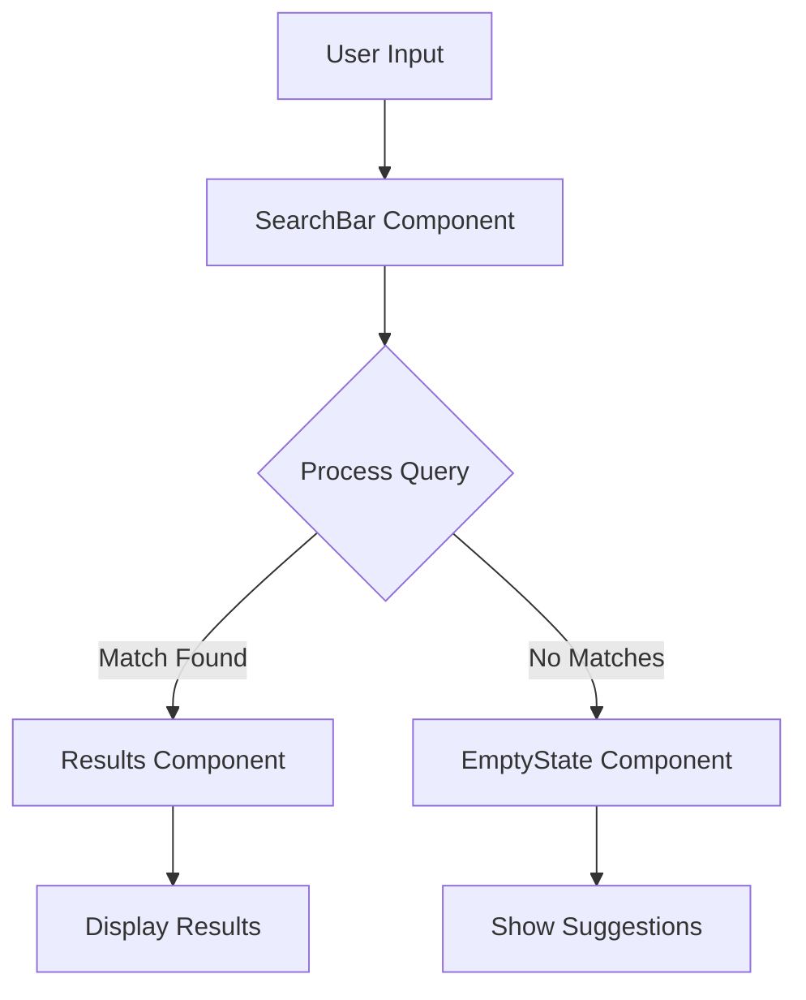

# Branching and Pull Request Workflow

This document outlines our branch management strategy and pull request workflow to maintain a clean, organized codebase.

## Branching Model

We follow a feature branch workflow where all development happens in dedicated branches instead of directly on the `main` branch.

### Branch Naming Convention

Branches should follow these naming patterns:

| Branch Type | Pattern | Example |
|-------------|---------|---------|
| Feature | `feature/descriptive-name` | `feature/dark-mode` |
| Bug Fix | `bugfix/issue-number-description` | `bugfix/123-navbar-overflow` |
| Documentation | `docs/description` | `docs/api-references` |
| Refactoring | `refactor/component-name` | `refactor/search-component` |
| Performance | `perf/description` | `perf/optimize-images` |
| Test | `test/feature-name` | `test/authentication` |

### Branch Workflow

1. **Fork the repository** to your GitHub account
2. **Create a new branch** from `main` using the naming convention above
3. **Develop your changes** in your branch
4. **Regularly sync** your fork with the upstream repository
5. **Push your branch** to your fork
6. **Create a Pull Request** following our template

## Pull Request Process

### Before Submitting a PR

1. **Run the linter** to ensure code style consistency: `npm run lint`
2. **Run tests** to ensure no functionality is broken: `npm run test`
3. **Build the project** to verify it compiles: `npm run build`
4. **Document your changes** in the PR description following our template

### PR Requirements

All PRs must:
- Follow the PR template
- Link to related issues
- Include tests for new functionality
- Pass CI checks
- Receive at least one approval from a code owner
- Have no merge conflicts with the target branch

### Review Process

1. **Initial review** performed by automated tools (linting, tests)
2. **Code review** performed by at least one maintainer
3. **Approval or requested changes** provided by reviewers
4. **Author addresses** any requested changes
5. **Final approval** before merging

## Merge Strategies

We use different merge strategies based on the size and nature of the change:

### Squash and Merge

Used for:
- Small bug fixes
- Simple features
- Documentation updates
- Dependencies updates

Benefits:
- Creates a clean, linear history
- Combines all PR commits into one
- Makes reversion simpler if needed

### Rebase and Merge

Used for:
- Larger features with meaningful commit history
- Complex refactoring
- Performance optimizations with distinct phases

Benefits:
- Preserves detailed development history
- Maintains authorship information
- Provides better context for future developers

## Labels & Milestones

### Issue/PR Labels

We use labels to categorize and prioritize work:

- `bug`: Something isn't working as expected
- `enhancement`: New features or improvements
- `documentation`: Documentation-only changes
- `good first issue`: Good for newcomers
- `help wanted`: Extra attention needed
- `priority: high/medium/low`: Urgency level
- `status: in-progress/blocked/ready`: Current state

### Milestones

Milestones are used to group issues and PRs into planned releases or project phases. They help track progress toward specific goals with deadlines.

## CI/CD Pipeline

Our GitHub Actions workflow automatically:
1. Runs linting checks
2. Executes tests
3. Builds the project
4. Applies appropriate labels
5. Notifies relevant team members for review

All PRs must pass these checks before they can be merged.

## Component Flow Diagrams

For significant feature PRs, we require a Mermaid diagram illustrating the component and data flow. This helps reviewers understand the architecture and impact of changes.

Example:

## Questions?

If you have questions about this workflow, please open an issue with the label `question` or reach out to the maintainers.
